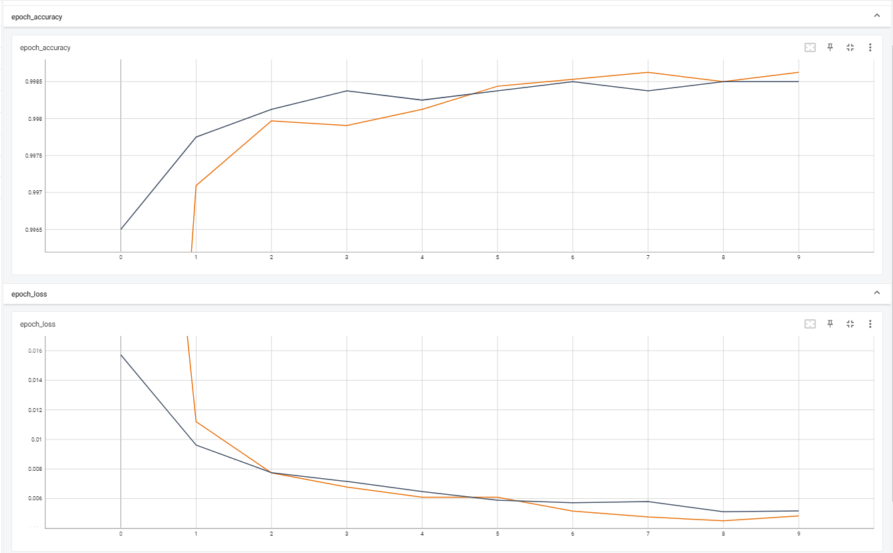

# Classifying Concrete Cracks Using Deep Learning: An Image Analysis Approach
 Classify concrete crack images

## Project description

Concrete can develop various types of cracks, including hairline cracks that appear as the concrete cures, shrinkage cracks that occur during the curing process, settlement cracks that occur when the ground underneath the slab isn't properly compacted or when part of the concrete sinks, and structural cracks that are caused by incorrect design. These cracks can pose a safety risk and threaten the durability of a building if they are not detected and addressed quickly. As an AI engineer, your task is to use image classification to identify whether or not concrete has cracks. Your work has the potential to save lives by ensuring that cracks are properly identified and addressed.

These are steps used to complete this project.
 
#### 1. Data Loading
> Loaded a dataset from a directory and splits it into training and validation sets using the image_dataset_from_directory function. The batch size and image size are specified, and the class names are stored in a variable.

 

#### 2. Data Pre-processing
> Converts the training and validation datasets into PrefetchDataset objects and applies image augmentation to them using a Sequential model. A sample augmented image is also displayed.

> Creates a feature extractor using MobileNetV2 and sets it to be non-trainable. A layer for data normalization is also created.

#### 3. Model Development
> Builds a model using the feature extractor, a global average pooling layer, a dense layer with 64 units and ReLU activation, and a dense output layer with softmax activation. The model takes in an image as input and outputs predictions for each class.

 

> Compile model using an Adam optimizer, a Sparse Categorical Crossentropy loss function, and accuracy as a metric.

> Creates a set of callbacks, including a TensorBoard callback to write log files, an early stopping callback to stop training when the validation loss stops improving, and a learning rate scheduler callback to decrease the learning rate as the number of epochs increases.

 

#### 4. Train Model
> Trains the model, specifying the training and validation datasets, the number of epochs, and the callbacks.

#### 5. Model Evaluation
> Evaluates the model on the validation set and displays the results.

#### 6. Save Model
> Saves the model to a file.
 
## Results

    
    
> The model accuracy is at 100%. This raises suspicion as it is very unlikely that a model would be able to achieve such a high level of precision, so caution should be exercised when using this code. Further investigation may be necessary to determine if there are any issues with the code that need to be addressed if necessary.
    

 

     TensorBoard graph showed minimal overfitting and loss. 
    
## Acknowledgement
> The dataset used for this project is by *[Çağlar Fırat Özgenel](https://data.mendeley.com/datasets/5y9wdsg2zt/2)*

> I would also like to express my sincere gratitude to Google Colab for providing a platform for me to conduct my research and develop my machine learning models. The availability of powerful GPUs and the convenience of cloud-based computing have greatly facilitated my work and allowed me to make significant progress in a short period of time.
